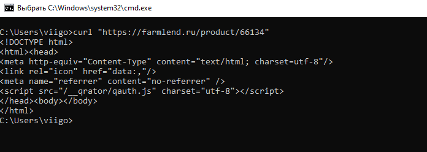

# Price Analyzer

## Цель проекта

Проект **Price Analyzer** был создан в рамках приобретения новых навыков, таких как:

- Формирование HTTP запросов на языке C++
- Парсинг HTML кода страниц, полученных HTTP запросами (без использования готовых библиотек, чтобы лучше понять структуру HTML)
- Работа с файлами `.xlsx` в C++

## Использованные библиотеки

Для разработки приложения были использованы следующие сторонние библиотеки:

- `curl.h` — для работы с HTTP запросами
- `OpenXLSX.hpp` — для обработки Excel файлов

Обе библиотеки добавлены в папку `auxiliary_libs` для удобства подключения.

## Структура проекта

- **Makefile** — для сборки проекта.
- **cookies.txt** — файл с сессионными куками. Создается автоматически при первом запуске программы.
- **final_monitoring.xlsx** —  выходной файл с результатами анализа, создается программой в режиме `primary` и необходим для режима `post`.
- **monitoring.xlsx** — входной файл с перечнем препаратов для анализа.
- **libcurl.dll** — библиотека, для работы с HTTP-запросами. Должна находиться в директории с исполняемым файлом.
- **main.cpp** — основной файл программы.

- **application/**
    - **application.cpp** — основной код приложения.

- **auxiliary_libs/**
    - **OpenXLSX** — библиотека для работы с `.xlsx` файлами.
    - **curl_x64-windows** — библиотека для HTTP-запросов.

- **excel_processor/**
    - **excel_processor.cpp** — обработка Excel файлов.

- **html_reader/**
    - **html_reader.cpp** — обработка HTML кода.

- **http_client/**
    - **callback_func.h** — функция обратного вызова для записи HTML кода страницы в буфер.
    - **http_client.cpp** — обработка HTTP запросов.

- **string_utils/**
    - **string_utils.cpp** — вспомогательные функции для работы со строками.

- **include/**
    - **application.h**  
    - **data_analyzer.h** — структура для анализа и записи цен в Excel. Также содержит конструктор для анализа цен, переданных через `std::vector<double>`.
    - **excel_processor.h**  
    - **html_reader.h**  
    - **http_client.h**  
    - **string_utils.h**

## Описание работы программы

Программа предназначена для анализа цен на лекарственные препараты на сайте `https://farmlend.ru/`.  
Она работает в двух режимах:

1. `Primary` — первичный анализ цен.
2. `Post` — повторный анализ для препаратов, для которых не удалось получить цены на предыдущем этапе.

На вход принимается файл `monitoring.xlsx` с перечнем лекарственных препаратов для анализа цен конкурентов.  

**Формат файла:**
```
В первой строке таблицы должны быть заголовки, среди которых обязательно должен присутствовать столбец с названием "Наименование товара" (регистр не важен). Под этим столбцом должны быть указаны препараты для анализа.
```

*Пример формата файла на input:*  
  


На выходе создается/перезаписывается файл `final_monitoring.xlsx`, в котором результат может быть `удовлетворительным`, `частичным` или `неудовлетворительным`.

#### Виды результата
1. `Удовлетворительный` - заполнены наименование, id и цены.
2. `Частичный` - заполнены наименование и id, не заполнены цены по причине утери сессионных куков.
3. `Неудовлетворительный` - заполнено наименование, не заполнены id и цены. id не удалось получить из-за выхода reCAPTCHA или потери интернет соединения, поэтому и цены не удалось получить.

  

### Алгоритм работы программы

Программа работает в бесконечном цикле, выходом из которого является обработка всего списка препаратов или нажатие клавиши `q` (или `Q`).

1. **Считывание данных из файла.**
    Программа считывает названия препаратов из файла `monitoring.xlsx` или `final_monitoring.xlsx` (в зависимости от выбранного режима). Названия должны быть в столбце с заголовком "Наименование товара".
2. **Получение id товара.**
    Для каждого препарата отправляется HTTP-запрос на страницу поиска сайта `farmlend.ru` (GET запрос по URL `"https://cdn.farmlend.ru/search?keyword=" + "[наименование препарата в url формате]"`). Из полученного HTML кода получаются наименования предложенных препаратов и их id. После чего предложенные наименования сопоставляются с наименованием, которое было указано в поиске. Таким образом находится лучший вариант и его id используется для дальнейших манипуляций.  
    *На этом этапе может сработать блокировка по reCAPTCHA, которая спадет через 10-15 минут.*
3. **Загрузка основной страницы товара.**
    Отправляется GET запрос по URL `"https://cdn.farmlend.ru/kazan/product/" + id + "?."` для получения сессионных куки и извлечения из кода страницы `csrf-token`.  
    *Если за короткий промежуток времени одна и та же страница загружается более 1 раза, сессионные куки могут быть утеряны. В таком случае получить цены не получится. При возниконовении этой проблемы надо подождать ~15 минут, чтобы сайт по-новой выдал куки.*
4. **Получение цен на препарат.**
    Отправляется POST запрос по URL `"https://cdn.farmlend.ru/ajax/get-variants?."` с использованием сессионных куки, `csrf-token` и сообщением `"dfm_id=" + id_ + "&sphere=0"`. В ответном на запрос HTML коде хранятся все цены на выбранный препарат в указанном городе(в моем случае kazan).
5. **Анализ данных.**
    Из полученных цен отбирается минимальная, максимальная и средняя цена, после чего данные заносятся в таблицу файла `final_monitoring.xlsx`.


## Проблемы и решения

### 1. Разные форматы названий препаратов
Препараты могут быть записаны в разных форматах в зависимости от аптечной сети. Например:
- Входное название: "КОНКОР КОР 2,5МГ. №30 ТАБ. П/О"
- На сайте: "Конкор кор 2.5мг таб.п/об.пл. №30"


Формат, используемый на сайте, отличается от формата, используемого в файле: регистром, порядком указания наименования, дозы, лекарственной формы и т.д.
Также используется разный формат сокращения слов и в десятичной части вещественных чисел вместо запятой используется точка.

Кроме этого встречаются случаи, когда в названии используются латинские буквы вместо кириллических:  
Пример: "ЭНАП-H 10МГ+25МГ. №20 ТАБ." вместо "Энап-н 10мг+25мг таб. №20" (Буква 'Н' взята из разных языков).


Для решения этой проблемы были разработаны функции для работы с `std::string`:
- **ToLowerUtf8()** — приведение строки к нижнему регистру в кодировке UTF-8.
- **ToRuFromAscii()** — замена латинских букв на кириллические (например, "H" на "н").
- **Split()** — разделение строки на части по заданному разделителю(в моем случае пробел). На выходе получается вектор из подстрок, входящих в название препарата({"конкор", "кор", "2.5мг", "таб.п", "об.пл", "№30"}). Это помогает сравнивать наименования препаратов по частям.
- **CountIdenticalSubstring()** - позволяет сравнивать части строк по совпадениям подстрок, присваивая полному совпадению значение 2, а частичному — 1. Это помогает учитывать незначительные различия.
Например, при сравнении 5мг и 2.5мг на уровне подстрок (**5мг** и 2.**5мг**) результат был бы равен 1, но при сравнении **5мг** и **5мг** результат был бы 2, так как сравнение прошло бы на уровне **строк целиком**.

### 2. Защита сайта

Сайт **farmlend.ru** защищен системой **Qrator** и **reCAPTCHA**. Для обхода Qrator был найден способ отправлять запросы через CDN сайта, который не защищен данной системой. Однако, reCAPTCHA пока обойти не удалось. Поэтому приложение может обрабатывать до 12 наименований за один запуск. Это ограничение можно обойти, если заранее подготовить список ID товаров(К примеру если очистить все цены в файле `final_monitoring.xlsx`, но оставить id и запустить приложение в режиме `post`).

### Обход защиты Qrator

Для сайта **farmlend.ru** был найден способ обхода защиты Qrator. Оказалось, что многие запросы для загрузки элементов страницы сайта отправляются не на сайт farmlend.ru, а на его CDN сервер, доступ к которому закрыт для простого пользователя. Добавление комбинации символов `?.`(не обязательно символы должны писаться слитно, но `?` должен указываться раньше, чем `.`) к URL обходит эту блокировку. Так же, как оказалось, Qrator не защищает этот CDN. Запросы отправляются на URL с поддоменом CDN и добавлением символов `?.`. 

Пример: Браузер с лёгкостью загрузит страницу с URL `https://farmlend.ru/product/66134`, но загрузка страницы в консоли `cmd` через `curl` выдаст сообщение:

  

Но `https://cdn.farmlend.ru/product/66134?.` позволяет получить HTML код страницы через `curl`

## Сборка

``` cmd
make build
```

## Запуск программы

Запуск осуществляется из директории с исполняемым файлом, `libcurl.dll` и файлами `monitoring.xlsx` (для первичного анализа) и `final_monitoring.xlsx`(для повторного анализа).

**Первичный анализ:**
```cmd
run.exe primary
```

**Повторный анализ анализ:**
```cmd
run.exe post
```
